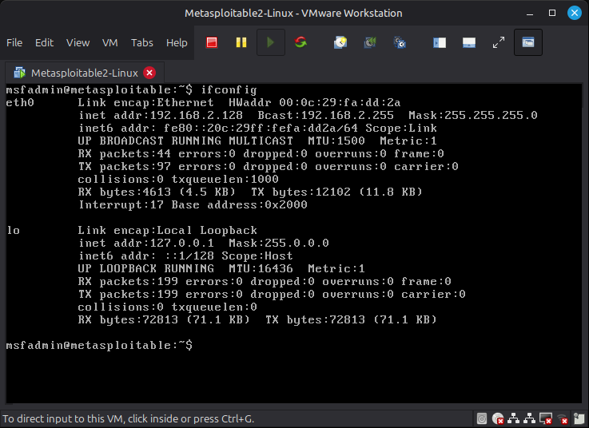
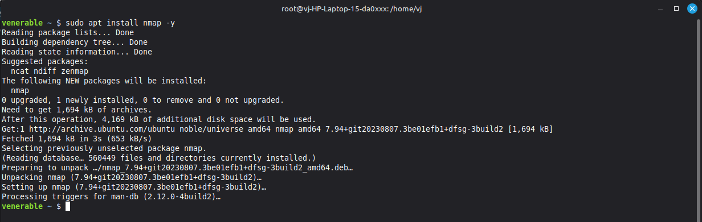
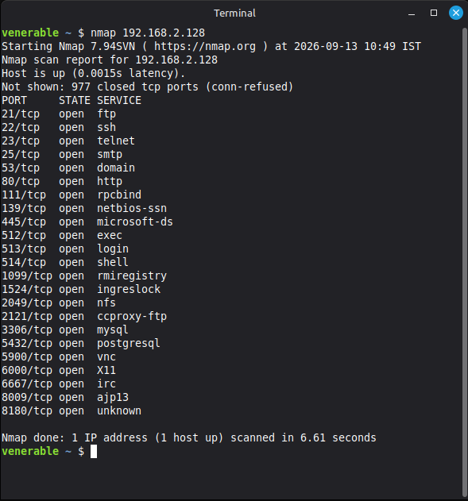
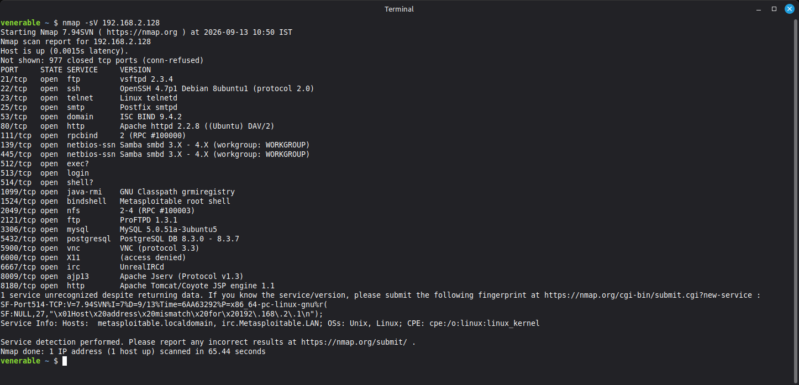
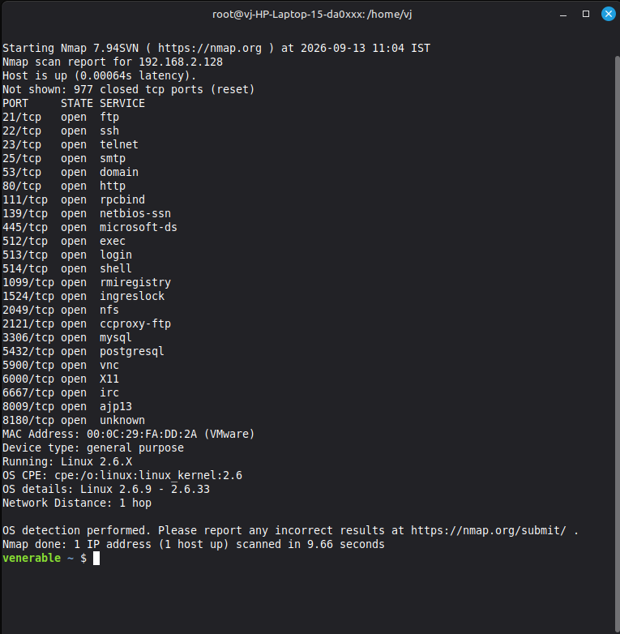

# Task 1: Basic Network Scanning with Nmap

**Objective:** Perform a network scan to identify open ports and services running on a local virtual machine using Nmap, and document the findings with security analysis.

---

## 🎥 Video Demonstration
Here is a walkthrough of the scanning process and tool execution:


---

## Core Concepts

### What is Nmap?
Nmap (Network Mapper) is a free and open-source utility for network discovery and security auditing. It uses raw IP packets to determine what hosts are available on the network, what services (application name and version) those hosts are offering, and what operating systems they are running.

### Why Network Scanning Matters
Network scanning is a critical first step in both offensive and defensive cybersecurity. For administrators, it helps identify misconfigured systems, rogue devices, and vulnerable services. For penetration testers, it provides a map of the attack surface to identify potential entry points into a system.

### ⚠️ Ethical Use Guidelines
Network scanning tools should **never** be used against external networks, production systems, or any machine you do not have explicit permission to test. Unauthorized scanning can trigger intrusion detection systems, cause service disruptions, and violate cyber laws. All scanning in this task was performed locally against a purposely vulnerable virtual machine (Metasploitable 2) hosted in a completely isolated environment.

---

## Tech Stack & Tools
*   **Scanning Tool:** Nmap
*   **Attacker OS:** Linux Terminal (Ubuntu)
*   **Target Machine:** Metasploitable 2 (Local VM)

---

## Steps Performed

1.  **Environment Setup:** Deployed Metasploitable 2 as a local Virtual Machine.
2.  **Tool Installation:** Installed Nmap on the host/attacker system using the following command:
    ```bash
    sudo apt install nmap -y
    ```
3.  **Basic Port Scan:** Executed `nmap 192.168.2.128` to identify standard open ports.
4.  **Service Version Scan:** Executed `nmap -sV 192.168.2.128` to identify specific application versions running on the open ports.
5.  **OS Detection Scan:** Executed `sudo nmap -O 192.168.2.128` to fingerprint the target operating system.

---

## Findings & Security Analysis
The detailed security analysis of the open ports and vulnerable services can be found in the [nmap_scan_results.txt](nmap_scan_results.txt) file included in this repository.

---

## Scan Evidence (Screenshots)

**1. Target Machine Setup (Metasploitable 2)**


**2. Nmap Installation**


**3. Basic Nmap Scan**



**4. Service Version Scan (-sV)**


**5. OS Detection Scan (-O)**


