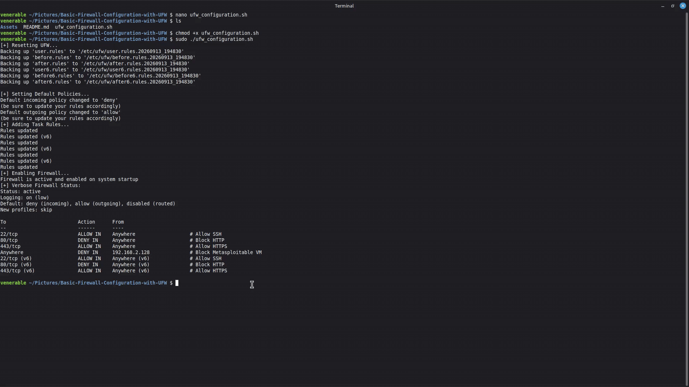
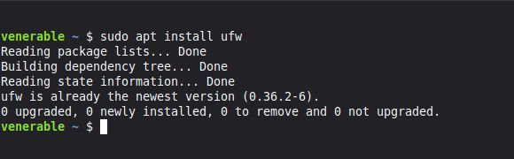
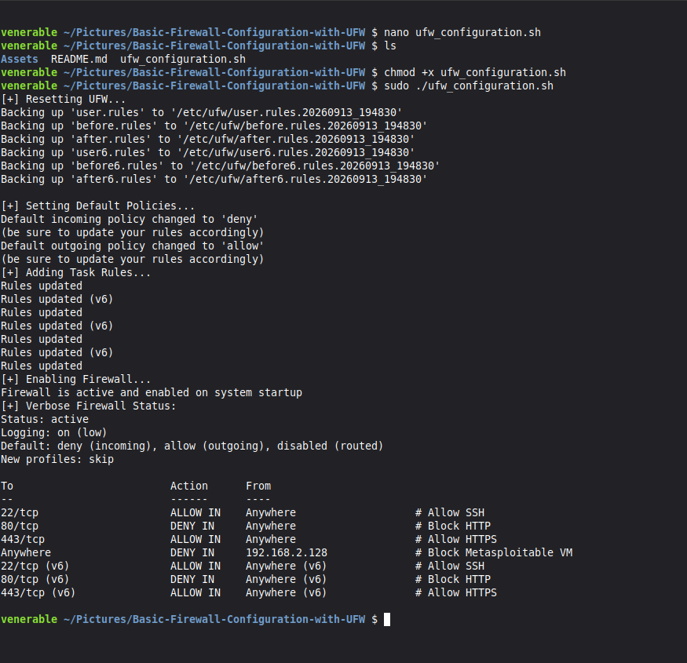
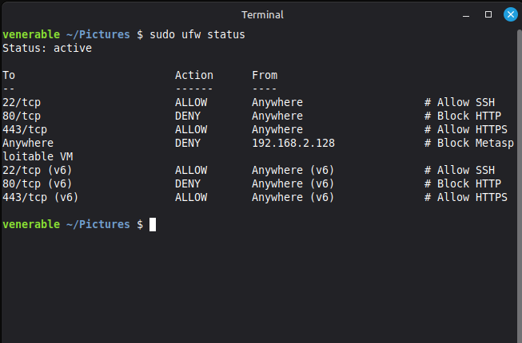
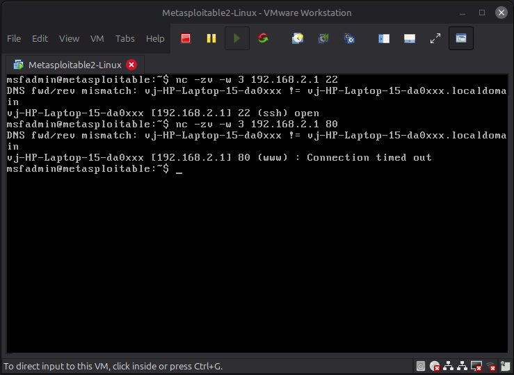

# Task 2: Basic Firewall Configuration with UFW

**Objective:** Configure a host-based firewall using UFW, implement access-control rules, block unwanted traffic, and verify the configuration through live network testing.

---

## 🎥 Video Demonstration

Here is a walkthrough of the firewall configuration and live traffic testing:



---

## Core Concepts

### What is UFW?

UFW (Uncomplicated Firewall) is a user-friendly firewall management tool for Linux. It provides a simple way to allow or deny network traffic based on ports, protocols, and source IP addresses.

### Why Firewall Configuration Matters

A firewall helps reduce a system's attack surface by controlling which network connections are permitted. A **default-deny incoming policy** ensures that only explicitly allowed services are accessible.

### ⚠️ Ethical Use Guidelines

All testing was performed in a controlled local virtual-machine environment using **Metasploitable 2**. Firewall and network testing should only be performed on systems where you have explicit permission.

---

## Tech Stack & Tools

* **Firewall:** UFW
* **Firewall Host:** Ubuntu Linux (`192.168.2.1`)
* **Testing Tool:** Netcat (`nc`)
* **Target Machine:** Metasploitable 2 (`192.168.2.128`)

---

## Steps Performed

1. **Environment Setup:** Deployed Metasploitable 2 as a local VM.
2. **UFW Installation:** Installed UFW using:

   ```bash
   sudo apt install ufw -y
   ```
3. **Default Policies:** Configured incoming traffic to `DENY` and outgoing traffic to `ALLOW`.
4. **Port Configuration:** Allowed SSH (`22/tcp`), denied HTTP (`80/tcp`), and allowed HTTPS (`443/tcp`).
5. **IP Filtering:** Blocked incoming traffic from `192.168.2.128`.
6. **Firewall Activation:** Enabled UFW and verified the active rules using:

   ```bash
   sudo ufw status verbose
   ```
7. **Traffic Testing:** Used Netcat from Metasploitable 2 to verify the firewall behavior.

---

## Firewall Rules

| Rule              | Action  |
| ----------------- | ------- |
| Incoming traffic  | `DENY`  |
| Outgoing traffic  | `ALLOW` |
| `22/tcp` — SSH    | `ALLOW` |
| `80/tcp` — HTTP   | `DENY`  |
| `443/tcp` — HTTPS | `ALLOW` |
| `192.168.2.128`   | `DENY`  |

---

## Findings & Security Analysis

The firewall successfully enforced the configured access-control policy.

* **SSH (`22/tcp`)** — Connection permitted ✅
* **HTTP (`80/tcp`)** — Connection timed out / blocked ✅
* **HTTPS (`443/tcp`)** — Explicitly permitted ✅
* **Metasploitable 2 IP (`192.168.2.128`)** — Explicitly blocked ✅

The Netcat tests provided practical verification that UFW was actively filtering network traffic.

---

## Firewall Evidence (Screenshots)

**1. Target Machine Setup (Metasploitable 2)**


**2. UFW Installation**



**3. Running UFW Configuration Script**



**4. UFW Status**



**5. Network Traffic Testing**



---

## 🎥 Live Testing

The GIF below demonstrates the firewall configuration and live network traffic verification:


